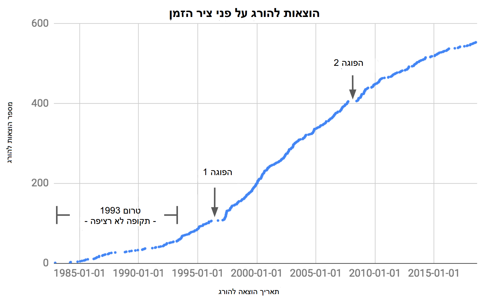

## הפוגות
הגרף הבא מציג את מספר ההוצאות להורג על פני ציר הזמן.
.
שימו לב שהיו כמה פרקי זמן בהם לא בוצעו הוצאות להורג. המטרה שלנו היא להבין מתיי בדיוק היו ההפסקות הללו ומה גרם להן.

האסטרטגיה שלנו היא להביא את הטבלה למצב שבו כל שורה על הוצאה להורג תכיל גם את תאריך ההוצאה להורג הקודמת. אנחנו יכולים למצוא את הבדלי הזמנים בין שני התאריכים, לסדר את הרשימה לפי הפרשי הזמנים בסדר יורד ולקרוא מתוכה את ההפוגות הארוכות ביותר.

 

##  מחשבות על חיבורים (JOINs)
אף אחת מהטכניקות שלמדנו עד עכשיו לא מתאימות כאן. הטבלה הרצויה שלנו תהיה באותו אורך של טבלת ה-`executions` המקוריתי, ואנחנו יכולים ליצור אגירות (aggregations) שיוצרים טבלאות קטנות יותר. הפרק [על בזלי](beazley.html) רק לימד אותנו לבצע פעולות ברמת השורה, שמגבילות אותנו לעבוד רק עם מידע שכבר נמצא בשורות. התאריך של ההוצאה הקודמת להורג נמצא מחוץ לשורה, ולכן עלנו להשתמש ב-`JOIN` כדי לצרף את המידע הנוסף.

בואו נניח שהמידע הנוסף שאנחנו רוצים נמצא בטבלה שנקראת `previous`, ובה שני טורים `(ex_number, lastex_date)`. נהיה מסוגלים להריץ את השאילתה הבא כדי להשלים את המשימה שלנו:

    SELECT
      last_ex_date AS start,
      ex_date AS end,
      ex_date - last_ex_date AS day_delta
    FROM executions
    JOIN previous
      ON executions.ex_number = previous.ex_number
    ORDER BY day_delta DESC
    LIMIT 10

בלוק ה-`JOIN` הוא המיקוד של הפרק הזה. במקום לראות בו שורה נפרדת זה יותר יעיל לפעמים לראות בה משהו כזה:   זה מדגיש איך `JOIN` יוצר טבלה מאוחדת גדולה שאז מוזנת לתוך בלוק ה-`FROM` כמו כל טבלה אחרת.

  <h3>פירוק טורים</h3>
  
השאילתה שלמעלה ראויה לתשומת לב גם בגלל שהפסקה <code>executions.ex_number = previous.ex_number</code> משתמשת במבנה <code>&lt;table&gt;.&lt;column&gt;</code> לפרט את הטורים. זה נדרש כאן מפני שבשתי הטבלאות יש טור שנקרא <code>ex_number</code>.

 
<a name="join_types">
## סוגים של חיבורים (Joins)
בלוק ה-`JOIN` מתממשים בצורת <code class='codeblock'>&lt;table1&gt; JOIN &lt;table2&gt; ON &lt;clause&gt;</code>. הפסקה עובדת בדומה ל-`WHERE <clause>`. כלומר, זוהי הצהרה שמוערכת כאמת (true) או שקר (false), ובכל פעם ששורה מהטבלה הראשונה ושורה אחרת מהטבלה השניה עומדות עם הפסקה ומוערכות כביטוי אמת, שתי השורות מתחברות.

אבל מה קורה לשורות שלא מתחברות? במקרה הזה לטבלת ה-`previous` לא התייה שורה להוצאה להורג מספר 1, משום שלא היו הוצאות להורג קודמות

ברירת המחדל של הפקודה <code>JOIN</code> היא היא לבצע מה שנקרא “חיבור פנימי" ("inner join"), במסגרתו שורות ללא התאמות מוסרות.

כדי לשמור את כל השורות שבטבלה השמאלית, נשתמש ב-<code>LEFT JOIN</code> במקום ה-<code>JOIN</code> הרגיל. החלקם הריקים של השורה נשארים ללא שינוי, מה שורה שהם יוערכו כ-to <code>NULL</code>.

החיבור <code>RIGHT JOIN</code> יכול לשמש כדי לשמר שורות לא תואמות בטבלה הימנית ו-<code>OUTER JOIN</code> יכול לשמש כדי לשמר שורות ללא התאמה משתי הטבלאות.

האבחנה האחרונה היא התמודדות עם כמה התאמות. נניח שיש לנו טבלאת `duplicated_previous` שמכילה שני עותקים של כל שורה בטבלת ה-`previous`. כל שורה של `executions` עכשיו תואמת שתי שורות ב-`duplicated_previous`.

החיבור יוצר מספיק שורות של `executions` כך שכל שורה מתאיימה של `duplicated_previous` מקבלת שותף משלה. בדרך זו חיבורים יכולים ליצור טבלאות ארוכות מהרכיבים שמרכיבים אותן

<sql-quiz
  data-title="סמנו את הצהרות האמת."
  data-description="בהנחה שיש לנו טבלה א (tableA) עם 3 שורות וטבלה ב (tableB) עם 5 שורות.">
  <sql-quiz-option
    data-value="cartesian_prod"
    data-statement="<code>tableA JOIN tableB ON 1</code> יחזיר 15 שורות."
    data-hint="הפסקה <code>ON 1</code> תחזיר תמיד ערך אמת (true), כך שכל שורה בטבלה א תהיה תואמת לכל שורה בטבלה ב."
    data-correct="true">
  </sql-quiz-option>
  <sql-quiz-option
    data-value="bad_cartesian"
    data-statement="<code>tableA JOIN tableB ON 0</code> תחזיר 0 שורות."
    data-hint="מאותה הסיבה ש-<code>ON 1</code> תחזיר 15 שורות."
    data-correct="true">
  </sql-quiz-option>
  <sql-quiz-option
    data-value="left_join_bad"
    data-statement="<code>tableA LEFT JOIN tableB ON 0</code> תחזיר 3 שורות."
    data-hint="ה-left join משמר את כל השורות מטבלה א (tableA) למרות שאין שורות תואמות בטבלה ב (tableB)."
    data-correct="true">
  </sql-quiz-option>
  <sql-quiz-option
    data-value="outer_join_bad"
    data-statement="<code>tableA OUTER JOIN tableB ON 0</code> תחזיר 8 שורות."
    data-hint="ה-outer join משמר את כל השורות מטבלה א (tableA) ומטבלה ב (tableb) למרות שלאף אחת מהשורות הללו אין שורה תואמת."
    data-correct="true">
  </sql-quiz-option>
  <sql-quiz-option
    data-value="outer_join_good"
    data-statement="<code>tableA OUTER JOIN tableB ON 1</code> תחזיר 15 שורות."
    data-hint="כל השורות של טבלה א (tableA) תואמות כל השורות של טבלה ב (tableB) בגלל הפסקה <code>tableA OUTER JOIN tableB ON 1</code>, כך שכל חיבור יחזיר 15 ורות. פעולות החבור (joins) השונות נבדלות ביניהן רק באופן שבו הן מתמודדות עם שורות ללא התאמה."
    data-correct="true">
  </sql-quiz-option>    

</sql-quiz>
 

## תאריכים
בואו ניקח הפסקה קצרה מחיבורים ונסתכל בשורה הזו בתבנית השאילתה הבא:

      ex_date - last_ex_date AS day_delta

הנחנו כאן הנחה משמעותית לפייה ניתן לבצע פעולת חיסור בין שני תאריכים. אבל דמייינו שאתם מחשב שמקבל שורה שכזו. האם תחזירו את מספר הימים בין התארכםי? מדוע לא את מספר השעות, או מספר השניות? כדי לסבך את העניינים, ל-SQLite אין ממש סוגי נתונים של תאריך או שעה (להבדיל מכמה צורות ודיאלקטים אחרים של SQL), כך שהטורים `ex_date` ו-`last_ex_date` יראו לכם כמו מחרוזות טקסט רגילות. זה כאילו אתם מתבקשים לבצע את הפעולה `hello`-`world`. מה המשמעות של זה בכלל?

למרבה המזל, SQLite כוללת כמה פונקציות שאומרות למחשב: “היי, מחרוזות הטקסט הללו שאני מעביר לך מכילות תאריכים ושעות. תתנהג איתן כמו שהיית מתנהג עם תאריך".

<sql-exercise
 data-question='חפשו ב<a href="https://www.sqlite.org/lang_datefunc.html">דוקומנטציה</a> איך לתקן את השאילתה כך שתחזיר את מספר הימים שבין שני התאריכםי.'
 data-default-text="SELECT '1993-08-10' - '1989-07-07' AS day_delta"
 data-solution="
SELECT JULIANDAY('1993-08-10') - JULIANDAY('1989-07-07') AS day_delta"
></sql-exercise>

 

## חיבורים עצמיים (Self Joins)
עם מה שלמדנו על תאריכים, אנחנו ייכולים לתקן את תבנית השאילתה שלנו:

    SELECT
      last_ex_date AS start,
      ex_date AS end,
      JULIANDAY(ex_date) - JULIANDAY(last_ex_date)
        AS day_delta
    FROM executions
    JOIN previous
      ON executions.ex_number = previous.ex_number
    ORDER BY day_delta DESC
    LIMIT 5

הצעד הבא הוא לבנות את טבלת ה-`previous`.
<sql-exercise
  data-question="כתבו שאילתה שמפיקה את טבלת ה-<code>previous</code>."
  data-comment="זכרו להשתמש בשמות חלופיים (aliases) כדי לגשת לשמות הטורים <code>(ex_number, last_ex_date)</code>."
  data-solution="
SELECT
  ex_number + 1 AS ex_number,
  ex_date AS last_ex_date
FROM executions
WHERE ex_number < 553"></sql-exercise>

כעת אנחנו יכולים להניח (nest) את השאילתה הזו בתוך התבנית שלמעלה:

<sql-exercise
  data-question="שלבו את השאילתה במייצרת את טבלת ה-<code>previous</code> בתוך התבנית."
  data-comment='שימו לב שאנחנו משתמשים כאן בשם חלופי (alias), במתן השם "previous" לתוצאות של השאילתה הפנימית.'
  data-default-text="
  SELECT last_ex_date AS start,
    ex_date AS end,
    JULIANDAY(ex_date) - JULIANDAY(last_ex_date) AS day_delta
FROM executions
JOIN (<your-query>) previous
  ON executions.ex_number = previous.ex_number
ORDER BY day_delta DESC
LIMIT 10"
  data-solution="
SELECT
  last_ex_date AS start,
  ex_date AS end,
  JULIANDAY(ex_date) - JULIANDAY(last_ex_date) AS day_delta
FROM executions
JOIN (
    SELECT
      ex_number + 1 AS ex_number,
      ex_date AS last_ex_date
    FROM executions
  ) previous
  ON executions.ex_number = previous.ex_number
ORDER BY day_delta DESC
LIMIT 10"></sql-exercise>

`previous` נובע מתוך `executions`, כך שאנחנו למעשה מחברים את טבלת ה-`executions` לעצמה. זה נקרא "חיבור עצמי" (“self join"), טכניקה רבת עוצמה שמאפשרת לשורות לגשת לנתונים מחלקים אחרים של אותה הטבלה.

יצרנו את טבלת ה-`previous` כדי להבהיר את המטרה שהטכניקה הזו משרתת. אבל אנחנו יכולים למעשה לכתוב את השאילתה הזו בצורה אלגנטית יותר, בכך שנחבר את טבלת ה-`executions` ישירות לעצמה.
<sql-exercise
  data-question="מלאו את פסקת ה-<code>JOIN ON</code> כדי ליצור גרסה אלגנטית יותר של השאילתה הקודמת."
  data-comment="שימו לב שעדיין תצטרכו ליצור שם חלופי (alias) לאחד העותקים כדי לוודא שאנחנו פונים אליו בצורה חד משמעית."

  data-default-text="SELECT
  previous.ex_date AS start,
  executions.ex_date AS end,
  JULIANDAY(executions.ex_date) - JULIANDAY(previous.ex_date)
    AS day_delta
FROM executions
JOIN executions previous
  ON <your-clause>
ORDER BY day_delta DESC
LIMIT 10"
  data-solution="
SELECT
  previous.ex_date AS start,
  executions.ex_date AS end,
  JULIANDAY(executions.ex_date) - JULIANDAY(previous.ex_date)
    AS day_delta
FROM executions
JOIN executions previous
  ON executions.ex_number = previous.ex_number + 1
ORDER BY day_delta DESC
LIMIT 10"
></sql-exercise>

אנחנו יכולים עכשיו להשתמש בתאריכים המדוייקים של ההפוגות בהוצאות להורג כדי לחקור מה קרה בכל תקופה. בשנים הראשונות לאחר שבוטל האיסור על עונש מוות היו תקופות ארוכות ללא הוצאות להורג כתוצאה ממספרם הנמוך של המשפטים עם דרישה לעונש מוות, לצד האתגרם החוקיים של החקיקה החדשה. לכן אנחנו מוציאים מהניתוח את ההפסקות שלפני 1993 ומתמקדים בשתי ההפוגות העיקריות שלאחר מכן.

הפוגה 1 התרחשה בלש האתגורים החוקייים ל-<a href="https://en.wikipedia.org/wiki/Antiterrorism_and_Effective_Death_Penalty_Act_of_1996">Antiterrorism and Effective Death Penalty Act of 1996</a> שנוצרו כתגובה למתקפה על מרכז הסחר העולמי ב-1993 והפיגועים באוקלהומה סיטי ב-1995. החקיקה הגבילה את הליכי התביעה כדי להפוך את עונש המוות לאפקטיבי יותר במיוחד למקרי טרור(<a href="https://deathpenaltyinfo.org/documents/1996YearEndRpt.pdf">מקור</a>).

הפוגה 2 נגרמה בשל השהייה שנקבעה על ידי בית המשפט העליון בזמן הדיונים בתיק
<a href="https://en.wikipedia.org/wiki/Baze_v._Rees">Baze v. Rees</a>, בו נבחנה השאלה האם זריקה קטלנית מפירה את התיקון השמיני לחוקה, שאוסר "ענישה אכזרית ולא רגילה". זה השפעי על הוצאות להורג בכל ארצות הברית, מפני שרוב המדינות השתמשו בתערובת של חומרים זהה לזו שבקנטאקי (Kentucky). בית המשפט העליון אשרר בסופו של דבר את החלטת בית המשפט של קנטאקי וההוצאות להורג בטקסס נמשכו כמה חודש לאחר מכן.

 

## סיכום
הרעיון הכלל מאחורי ה-JOINs היה ליצור טבלה משופרת משום שהטבלה המקורית לא הכילה את המידע שנדרש. זוהי גישה יעילה בגלל שהיא משחררת אותנו מהמגבלות של הטבלה היחידה ומאפשר לנו לאחד מספר טבלאות בדרכים מורכבות. ראינו גם שעם המורככבות הזו יש חשיבות לניהול קפדני. מתן שמות חלופיים (aliasing) לטבלאות, שינוי שמות טורם והגדרות נכונות של פסקאות `JOIN ON` הן טכניקות שיעזרו לנו לשמר את הסדר.
