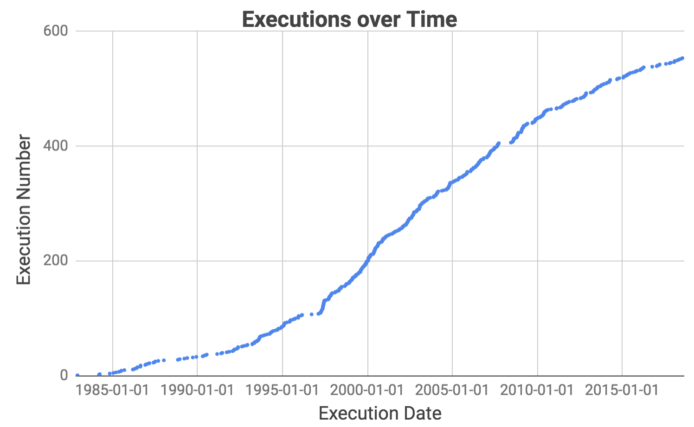
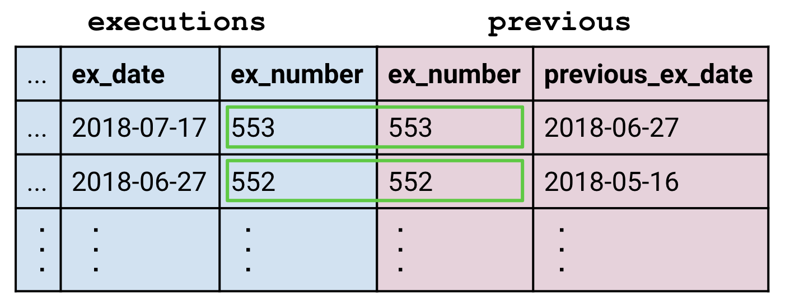
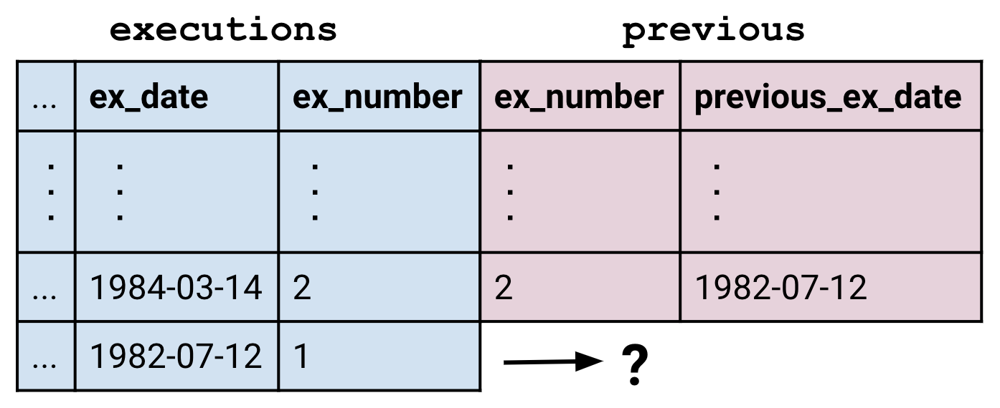
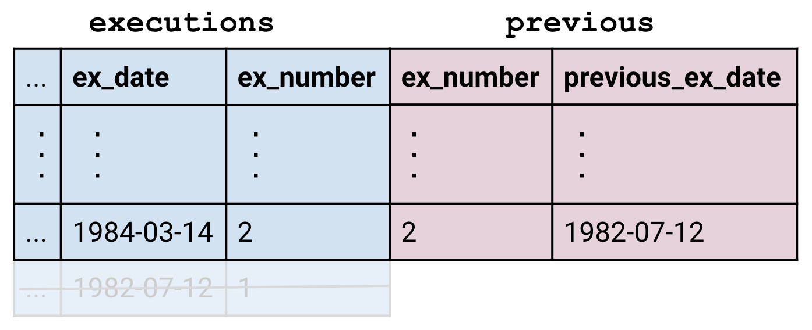
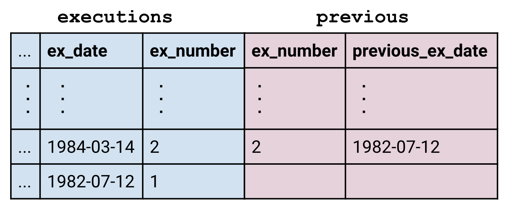
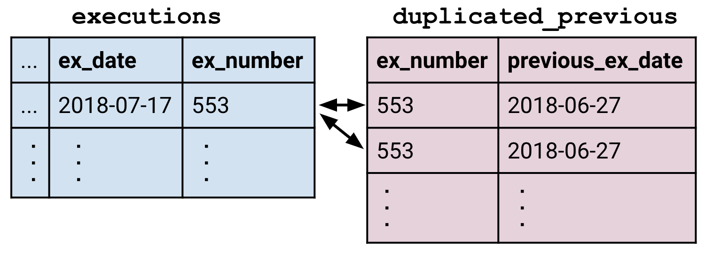
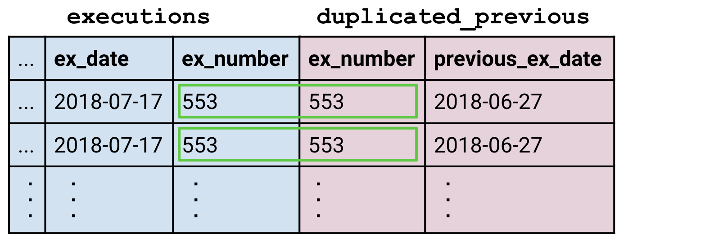
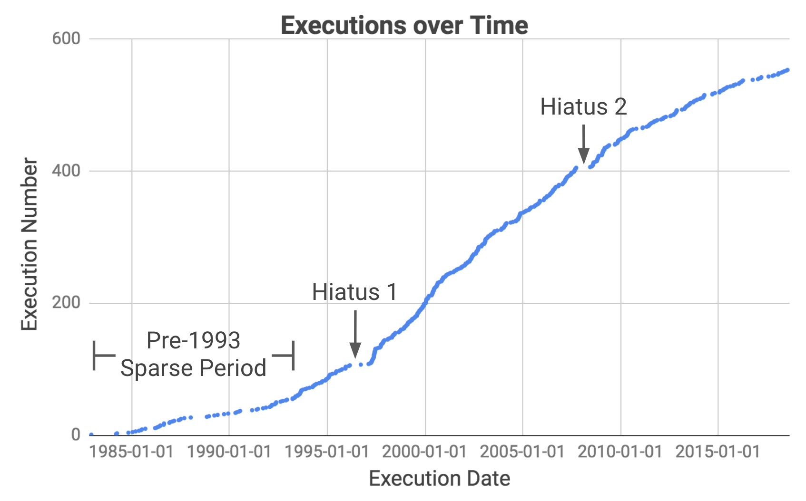

## Hiatuses
This graph shows executions over time. Notice that there have been several extended periods when no executions took place. Our goal is to figure out exactly when they were and research their causes.

Our strategy is to get the table into a state where each row also contains the date of the execution before it. We can then find the time difference between the two dates, order them in descending order, and read off the longest hiatuses.

 

## Thinking about Joins
None of the techniques we've learned so far are adequate here. Our desired table has the same length as the original `executions` table, so we can rule out aggregations which produce a smaller table. The [Beazley](beazley.html) chapter only taught us row operations which limit us to working with information already in the rows. However, the date of the previous execution lies outside a row so we have to use `JOIN` to bring in the additional information.

Let's suppose the additional information we want exists in a table called `previous` which has two columns `(ex_number, last_ex_date)`. We would be able to run the following query to complete our task:

    SELECT
      last_ex_date AS start,
      ex_date AS end,
      ex_date - last_ex_date AS day_difference
    FROM executions
    JOIN previous
      ON executions.ex_number = previous.ex_number
    ORDER BY day_difference DESC
    LIMIT 10

The `JOIN` block is the focus of this section. Instead of viewing it as a line on its own, it is often helpful to look at it like this:  This emphasizes how `JOIN` creates a big combined table which is then fed into the `FROM` block just like any other table.

  <h3>Disambiguating Columns</h3>
  
The query above is also notable because the clause <code>executions.ex_number = previous.ex_number</code> uses the format <code>&lt;table&gt;.&lt;column&gt;</code> to specify columns. This is only necessary here because both tables have a column called <code>ex_number</code>.

 
<a name="join_types">
## Types of Joins
The `JOIN` block takes the form of <code class='codeblock'>&lt;table1&gt; JOIN &lt;table2&gt; ON &lt;clause&gt;</code>. The clause works the same way as in <code class='codeblock'>WHERE &lt;clause&gt;</code>. That is, it is a statement that evaluates to true or false, and anytime a row from the first table and another from the second line up with the clause being true, the two are matched:

But what happens to rows which have no matches? In this case, the `previous` table didn't have a row for execution number 1 because there aren't any executions prior to it.

 The <code>JOIN</code> command defaults to performing what is called an "inner join" in which unmatched rows are dropped.

To preserve all the rows of the left table, we use a <code>LEFT JOIN</code> in place of the vanilla <code>JOIN</code>. The empty parts of the row are left alone, which means they evaluate to <code>NULL</code>.

The <code>RIGHT JOIN</code> can be used to preserve unmatched rows in the right table, and the <code>OUTER JOIN</code> can be used to preserve unmatched rows in both.

The final subtlety is handling multiple matches. Say we have a `duplicated_previous` table which contains two copies of each row of the `previous` table. Each row of `executions` now matches two rows in `duplicated_previous`.

The join creates enough rows of `executions` so that each matching row of `duplicated_previous` gets its own partner. In this way, joins can create tables that are larger than their constituents.

<sql-quiz
  data-title="Mark the true statements."
  data-description="Suppose we have tableA with 3 rows and tableB with 5 rows.">
  <sql-quiz-option
    data-value="cartesian_prod"
    data-statement="<code>tableA JOIN tableB ON 1</code> returns 15 rows."
    data-hint="The <code>ON 1</code> clause is always true, so every row of tableA is matched against every row of tableB."
    data-correct="true"></sql-quiz-option>
  <sql-quiz-option
    data-value="bad_cartesian"
    data-statement="<code>tableA JOIN tableB ON 0</code> returns 0 rows."
    data-hint="For the same reason that <code>ON 1</code> returns 15 rows."
    data-correct="true"></sql-quiz-option>
  <sql-quiz-option
    data-value="left_join_bad"
    data-statement="<code>tableA LEFT JOIN tableB ON 0</code> returns 3 rows."
    data-hint="The left join preserves all the rows of tableA even though no rows of tableB match."
    data-correct="true"></sql-quiz-option>
  <sql-quiz-option
    data-value="outer_join_bad"
    data-statement="<code>tableA OUTER JOIN tableB ON 0</code> returns 8 rows."
    data-hint="The outer join preserves all the rows of tableA and tableB even though none of them are paired."
    data-correct="true"></sql-quiz-option>
  <sql-quiz-option
    data-value="outer_join_good"
    data-statement="<code>tableA OUTER JOIN tableB ON 1</code> returns 15 rows."
    data-hint="All the rows of tableA match all of the rows of tableB because of the <code>on 1</code> clause, so any join will return 15 rows. The different joins only differ in how they handle unmatched rows."
    data-correct="true"></sql-quiz-option>
</sql-quiz>

 

## Dates
Let's take a break from joins for a bit and look at this line in our template query:

      ex_date - last_ex_date AS day_difference

We've made a big assumption that we can subtract dates from one another. But imagine you're the computer receiving a line like this. Do you return the number of days between the dates? Why not hours or seconds? To make things worse, SQLite doesn't actually have date or time types (unlike most other SQL dialects) so the `ex_date` and `last_ex_date` columns look like ordinary strings to you. You're effectively being asked to do `'hello' - 'world'`. What does that even mean?

Fortunately, SQLite contains a bunch of functions to tell the computer: "Hey, these strings that I'm passing you actually contain dates or times. Act on them as you would a date."

<sql-exercise
 data-question='Look up <a href="https://www.sqlite.org/lang_datefunc.html">the documentation</a> to fix the query so that it returns the number of days between the dates.'
 data-default-text="SELECT '1993-08-10' - '1989-07-07' AS day_difference"
 data-solution="
SELECT JULIANDAY('1993-08-10') - JULIANDAY('1989-07-07') AS day_difference"
></sql-exercise>

 

## Self Joins
With what we learned about dates, we can correct our template query:

    SELECT
      last_ex_date AS start,
      ex_date AS end,
      JULIANDAY(ex_date) - JULIANDAY(last_ex_date)
        AS day_difference
    FROM executions
    JOIN previous
      ON executions.ex_number = previous.ex_number
    ORDER BY day_difference DESC
    LIMIT 5

The next step is to build out the `previous` table.
<sql-exercise
  data-question="Write a query to produce the <code>previous</code> table."
  data-comment="Remember to use aliases to form the column names<code>(ex_number, last_ex_date)</code>. Hint: Instead of shifting dates back, you could shift <code>ex_number</code> forward!"
  data-solution="
SELECT
  ex_number + 1 AS ex_number,
  ex_date AS last_ex_date
FROM executions
WHERE ex_number < 553"></sql-exercise>

Now we can nest this query into our template above:
<sql-exercise
  data-question="Nest the query which generates the <code>previous</code> table into the template."
  data-comment='Notice that we are using a table alias here, naming the result of the nested query "previous".'
  data-default-text="SELECT
  last_ex_date AS start,
  ex_date AS end,
  JULIANDAY(ex_date) - JULIANDAY(last_ex_date)
    AS day_difference
FROM executions
JOIN (<your-query>) previous
  ON executions.ex_number = previous.ex_number
ORDER BY day_difference DESC
LIMIT 10"
  data-solution="
SELECT
  last_ex_date AS start,
  ex_date AS end,
  JULIANDAY(ex_date) - JULIANDAY(last_ex_date) AS day_difference
FROM executions
JOIN (
    SELECT
      ex_number + 1 AS ex_number,
      ex_date AS last_ex_date
    FROM executions
  ) previous
  ON executions.ex_number = previous.ex_number
ORDER BY day_difference DESC
LIMIT 10"
></sql-exercise>

`previous` is derived from `executions`, so we're effectively joining `executions` to itself. This is called a "self join" and is a powerful technique for allowing rows to get information from other parts of the same table.

We've created the `previous` table to clarify the purpose that it serves. But we can actually write the query more elegantly by joining the `executions` table directly to itself.
<sql-exercise
  data-question="Fill in the <code>JOIN ON</code> clause to complete a more elegant version of the previous query."
  data-comment="Note that we still need to give one copy an alias to ensure that we can refer to it unambiguously."
  data-default-text="SELECT
  previous.ex_date AS start,
  executions.ex_date AS end,
  JULIANDAY(executions.ex_date) - JULIANDAY(previous.ex_date)
    AS day_difference
FROM executions
JOIN executions previous
  ON <your-clause>
ORDER BY day_difference DESC
LIMIT 10"
  data-solution="
SELECT
  previous.ex_date AS start,
  executions.ex_date AS end,
  JULIANDAY(executions.ex_date) - JULIANDAY(previous.ex_date)
    AS day_difference
FROM executions
JOIN executions previous
  ON executions.ex_number = previous.ex_number + 1
ORDER BY day_difference DESC
LIMIT 10"
></sql-exercise>

We can now use the precise dates of the hiatuses to research what happened over each period. In the years immediately after the ban on capital punishment was lifted, there were long periods without executions due to the low number of death sentences, coupled with legal challenges to the new ruling. We thus exclude intermissions before 1993 and focus on two major hiatuses since.

Hiatus 1 was due to legal challenges to the <a href="https://en.wikipedia.org/wiki/Antiterrorism_and_Effective_Death_Penalty_Act_of_1996">Antiterrorism and Effective Death Penalty Act of 1996</a> created in response to the 1993 World Trade Center and 1995 Oklahoma City bombings. The act limited the appeals process  to make the death penalty more effective especially for terrorism cases (<a href="https://deathpenaltyinfo.org/documents/1996YearEndRpt.pdf">Source</a>).

Hiatus 2 was caused by a stay enacted by the Supreme Court while it weighed in on <a href="https://en.wikipedia.org/wiki/Baze_v._Rees">Baze v. Rees</a> which examined if lethal injection violates the Eighth Amendment prohibiting "cruel and unusual punishment". This affected executions across America because most states were using the same drug cocktail as Kentucky. The Supreme Court eventually affirmed the Kentucky court decision and executions in Texas resumed a few months later.

 

## Recap

The big idea behind `JOIN`s has been to create an augmented table because the original didn't contain the information we needed. This is a powerful concept because it frees us from the limitations of a single table and allows us to combine multiple tables in potentially complex ways. We've also seen that with this extra complexity, meticulous bookkeeping becomes important. Aliasing tables, renaming columns and defining good `JOIN ON` clauses are all techniques that help us maintain order.
