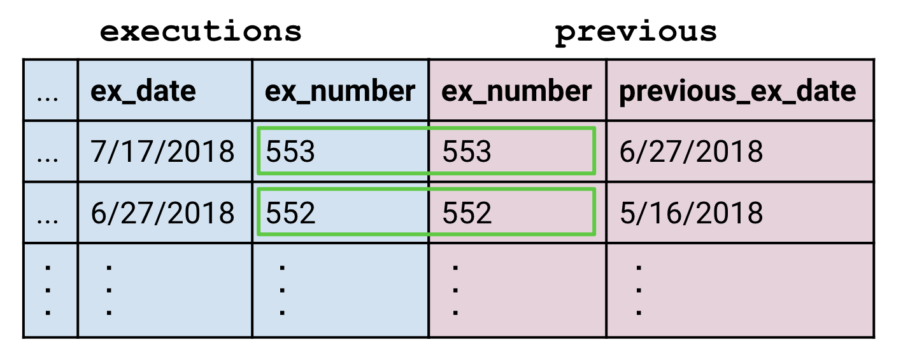
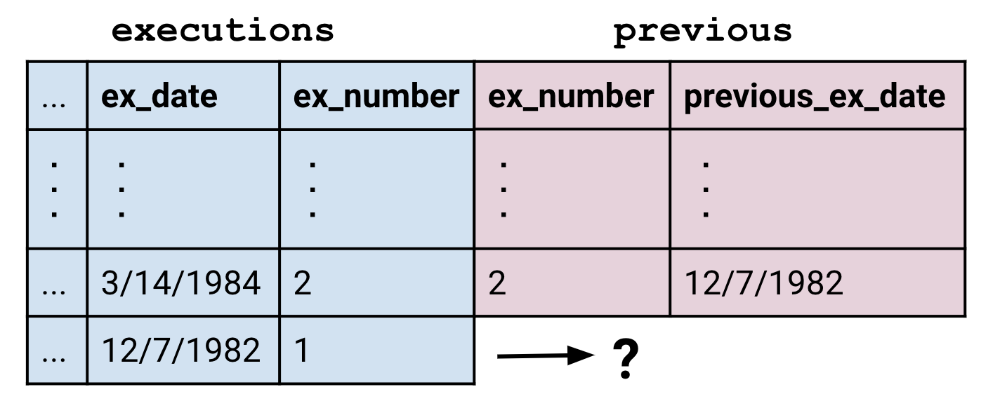
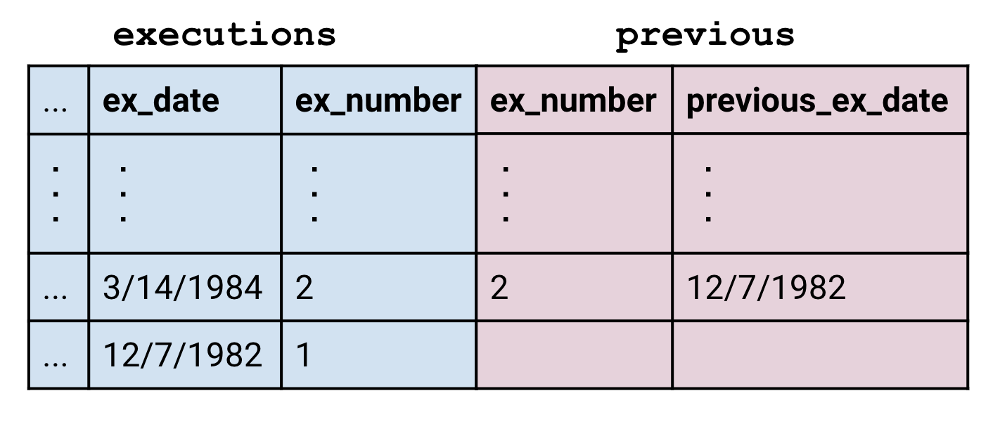

## Hiatuses
This graph shows executions over time. Notice the periods when no executions occur. Our goal is to figure out when they were and research their causes.

Our strategy is to get the table into a state where each row also contains the date of the execution before it. We can then find the time difference between the two dates, order them in descending order, and read off the longest hiatuses.

 

## Reading JOINs
None of the techniques we've learned so far are adequate here. Our desired table has the same length as the original `executions` table, so we can rule out aggregations which produce a smaller table. The [Beazley](beazley.html) tutorial only taught us row operations which limit us to working with information already in the rows. However, the date of the previous execution lies outside a row so we have to use `JOIN` to bring in the additional information.

Let's suppose the additional information we want exists in a table called `previous` which has two columns `(ex_no, previous_ex_date)`. We would be able to run the following query to complete our task:

    SELECT
      previous_ex_date AS start,
      ex_date AS end,
      ex_date - previous_ex_date AS time_delta
    FROM executions
    JOIN previous
      ON executions.ex_number = previous.ex_number
    ORDER BY time_delta DESC

The `JOIN` block is the focus of this section. Instead of viewing it as a line on its own, it is often helpful to look at it like this:  This emphasizes how `JOIN` creates a big combined table which is then fed into the `FROM` block just like any other table.

  <h3>Disambiguating columns</h3>
  
The query above is also notable because the clause <code>executions.ex_no = previous.ex_no</code> uses the format <code>&lt;table&gt;.&lt;column&gt;</code> to specify columns. This is only necessary here because both tables have a column called <code>ex_number</code>.

 
<a name="join_mechanics">
## Mechanics of a JOIN
The `JOIN` block takes the form of <code class='codeblock'>&lt;table1&gt; JOIN &lt;table2&gt; ON &lt;clause&gt;</code>. The clause works the same way as in `WHERE <clause>`. That is, it is a statement that evaluates to true or false, and anytime a row from the first table and another from the second line up with the clause being true, the two are matched:

But what happens to rows which have no matches? In this case, the `previous` table didn't have a row for execution number 1 because there aren't any executions prior to it.

 The <code>JOIN</code> command defaults to performing what is called an "inner join" in which unmatched rows are dropped.

To preserve all the rows of the left table, we use a <code>LEFT JOIN</code> in in place of the vanilla <code>JOIN</code>. The empty parts of the row are left alone, which means they evaluate to <code>NULL</code>.

The <code>RIGHT JOIN</code> can be used to preserve unmatched rows in the right table, and the <code>OUTER JOIN</code> can be used to preserve unmatched rows in both.

<sql-quiz
  data-title="Mark the true statements."
  data-description="Suppose we have tableA with 3 rows and tableB with 5 rows.">
  <sql-quiz-option
    data-value="cartesian_prod"
    data-statement="<code>tableA JOIN tableB ON 1</code> returns 15 rows."
    data-hint="The <code>&lt;clause&gt;</code> always returns true, so every row of tableA is matched against every row of tableB."
    data-correct="true"></sql-quiz-option>
  <sql-quiz-option
    data-value="bad_cartesian"
    data-statement="<code>tableA JOIN tableB ON 0</code> returns 0 rows."
    data-hint="For the same reason that <code>ON 1</code> returns 15 rows."
    data-correct="true"></sql-quiz-option>
  <sql-quiz-option
    data-value=""
    data-statement=""
    data-hint=""></sql-quiz-option>
</sql-quiz>

 

## Self Joins

 

## Dates

 

## Recap
