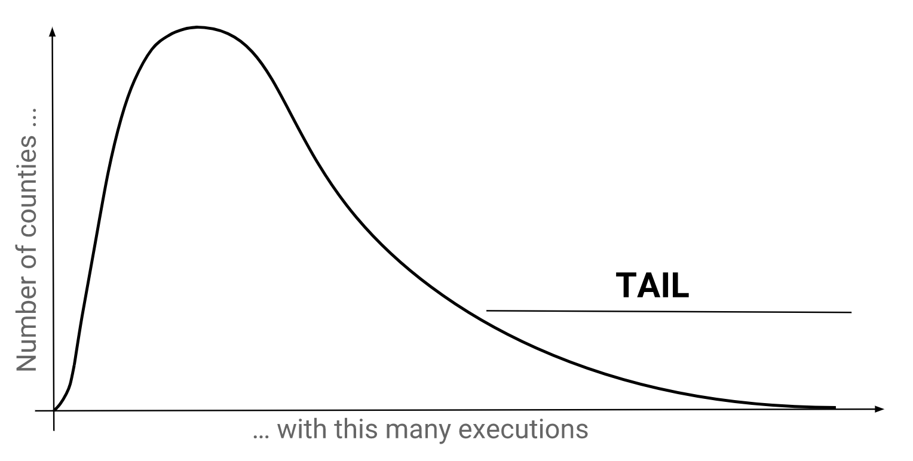

## Long Tails
Long tails refer to small numbers of samples which occur a large number of times. When we plot these out, they form a small sliver far to the right of the center of mass which looks like a tail.  Long tails indicate the presence of outliers whose unusual behaviors may be of interest to us. In Texas, several counties have been known to account for most of the executions.

Let's find the percentage of executions from each county so that we know which ones to examine further.

 

## Aggregations
There are two numbers we need to calculate such a percentage:
1. 
Executions in each county, and

2. 
Executions in Texas.

Until now, each row in the output has come from a single row of input. However, here we have both the numerator and denominator requiring information from multiple rows of input. This tells us we need to use an aggregation function because they <i>take multiple rows of data and combine them into one number.</i>

 

## The COUNT Function
`COUNT` is probably the most widely-used aggregate function. As the name suggests, it counts things! For instance, <code class='codeblock'>COUNT(my_column)</code> returns the number of non-null rows in `my_column`.

<sql-exercise
  data-question="Edit the query to find how many inmates provided last statements."
  data-comment="We can use <code>COUNT</code> here because <code>NULL</code>s are used when there are no statements."
  data-default-text="SELECT COUNT(first_name) FROM executions"
  data-solution="SELECT COUNT(last_statement) FROM executions"></sql-exercise>

As you can tell, the `COUNT` function is intrinsically tied to the concept of `NULL`s. Let's make a small digression to learn about `NULL`s.

  <h3>Nulls</h3>
  
In SQL, <code>NULL</code> is the value of an empty entry. This is different from the empty string <code>''</code> and the integer <code>0</code>, both of which  are <i>not</i> considered <code>NULL</code>. To check if an entry is <code>NULL</code>, use <code>IS</code> and <code>IS NOT</code> instead of <code>=</code> and <code>!=</code>.

  <sql-exercise
    data-question="Verify that 0 and the empty string are not considered NULL."
    data-comment="Recall that this is a compound clause. Both of the two <code>IS NOT NULL</code> clauses have to be true for the query to return <code>true</code>."
    data-default-text="SELECT (0 IS NOT NULL) AND ('' IS NOT NULL) "
    data-solution="SELECT 0 IS NOT NULL AND '' IS NOT NULL "></sql-exercise>

With this, we know just enough to get one of the numbers we need:
<sql-exercise
data-question="Find the total number of executions in the dataset."
data-comment="The idea here is to pick one of the columns that you're confident has no <code>NULL</code>s."
data-default-text=""
data-solution="SELECT COUNT(*) FROM executions"></sql-exercise>

So far so good. But what if we don't know which columns are `NULL`-free? Worse still, what if none of the columns are `NULL`-free? Surely there must still be a way to find the length of the table!

The solution is `COUNT(*)`. This is reminiscent of `SELECT *` where the `*` represents all columns. In practice `COUNT(*)` counts rows as long as *any one* of their columns is non-null. This helps us find table lengths because a table shouldn't have rows that are completely null.

<sql-exercise
data-question="Verify that <code>COUNT(*)</code> gives the same result as before."
data-default-text="SELECT COUNT(*) FROM executions"></sql-exercise>

 

## Practice

<sql-exercise
  data-question="Find the number of inmates who have declined to give a last statement."
  data-comment="Just for fun, try to do it without a <code>WHERE</code> block. The hint is to combine two of the earlier exercises."
  data-default-text=""
  data-solution='SELECT COUNT(*) - COUNT(last_statement) FROM executions'></sql-exercise>

<sql-exercise
  data-question="Find the minimum, maximum and average age of inmates at time of execution."
  data-comment="Use the <code>MIN</code>, <code>MAX</code>, and <code>AVG</code> aggregation functions."
  data-default-text="SELECT exn_age FROM executions"
  data-solution='SELECT MIN(exn_age), MAX(exn_age), AVG(exn_age) FROM executions'></sql-exercise>

<sql-exercise
  data-question="Find the length of the longest last statement (based on character count)."
  data-comment="You can compose functions together. Use the <code>LENGTH</code> function which returns the number of characters in a string."
  data-default-text=""
  data-solution='SELECT MAX(LENGTH(last_statement)) FROM executions'></sql-exercise>

 

## A Strange Query
As I mentioned in <a href="frontmatter.html#pedagogy">Pedagogy</a>, learning SQL is primarily about learning a mental model of what the computer is doing with your query; and at the risk of belaboring the point, the crucial thing about aggregations is that the computer takes a stack of rows and returning just *one*.

Can you see why the following doesn't make sense?  `SELECT first_name, COUNT(*) FROM executions`.

`COUNT(*)` is trying to return a single entry consisting the length of the execution table. `first_name` is trying to return one entry for each row. Should the computer return one or multiple rows? If it returns one, which `first_name` should it pick? If it returns multiple, is it supposed to replicate the `COUNT(*)` result across all the rows?

<sql-exercise
  data-question="See what happens when you run this strange query."
  data-comment=""
  data-default-text="SELECT first_name, COUNT(*) FROM executions"></sql-exercise>

In practice, databases try to return something sensible even though you pass in nonsense. In this case, our database picks the first name from the last entry in our table. Since our table is in reverse chronological order, the last entry is Charlie Brook's Jr., the first person executed since the Supreme Court lifted the ban on the death penalty. Different databases will handle this case differently so it's best not to count on this behavior. If you know you want the last entry, use the `LAST` aggregation function instead.

  <h3>SQL Dialects and Databases</h3>
  
Although we've called this a SQL tutorial, if you want to be pedantic it really is a <i>SQLite</i> tutorial. This is because SQL is an imaginary concept, a platonic ideal. In reality, there are only dialects that try to conform to the SQL specifications.

  
SQL is also under-specified, meaning that some functionality is not specified by the standards. For instance, the standards don't say whether the string length-finding function should be called <code>LEN</code> (SQL Server) or <code>LENGTH</code> (SQLite); or how identifiers like table or column names should be quoted (<code>`</code> in MySQL, <code>"</code> in SQLite).

  
To make matters worse, even a single query in a single dialect can be processed differently because the underlying databases can have different architectures. For instance, the PostgreSQL dialect can be used on databases distributed over many different physical machines, and ones consisting a single file. It means that the mental models we develop here are just a crutch. They may not reflect exactly what the database is doing.

  
We've picked SQLite, which is both a dialect and implementation, because it's one of the most common databases around. We've also tried to focus on the core functionality and mental model of SQL rather than distinctive parts of SQLite. With a robust mental model in place, it's easy to switch between SQL dialects and databases.
  

 

## Recap
Our aim in this section was to find the percentage of executions that have occurred in each county. We learned to apply aggregate functions over the entire dataset which allowed us to find the denominator: the total executions in our dataset.

Though we've not got this far, we already have the tools to find the numerator: executions by county. We could run `SELECT COUNT(*) FROM executions WHERE county=<county>` for each of the 254 counties in Texas, though this is obviously not the way forward.

In the next section, we'll learn to apply aggregate functions on subsets of the dataset using the `GROUP BY` block. This will allow us to find the per-county counts without having to run 254 individual queries.
